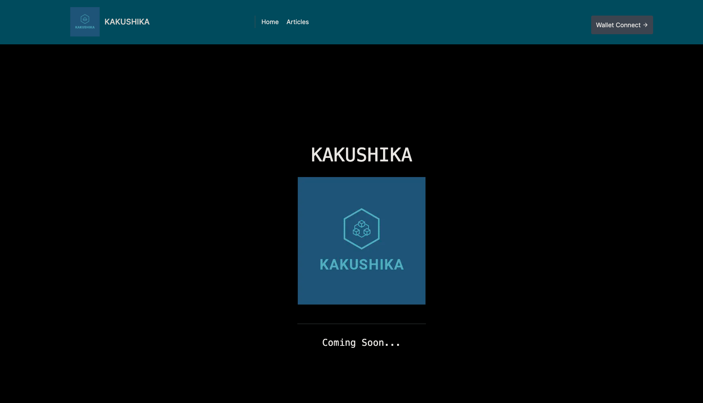
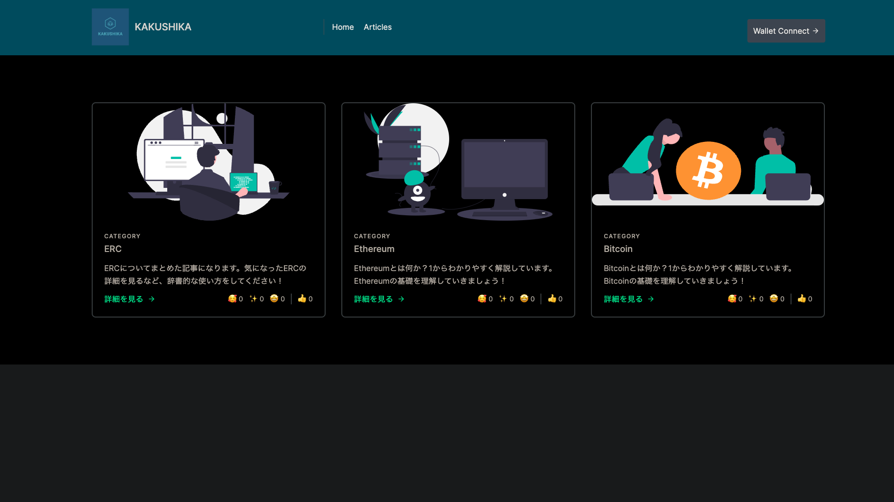
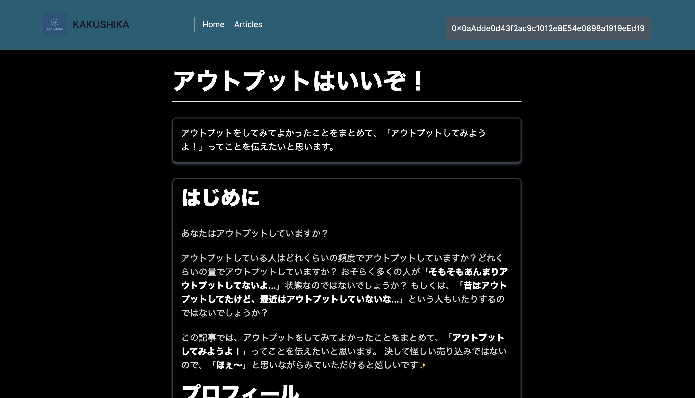

# KAKUSHIKA

- Output to Earnプラットフォーム
- アウトプットをどんどんして稼ごう！

## Product

- [https://kakushika.vercel.app/](https://kakushika.vercel.app/)

https://github.com/cardene777/KAKUSHIKA/assets/61857866/1ae6dcfa-8d70-4084-83d5-a26f76b41476

https://www.canva.com/design/DAFspKnu__Y/DBe3KqAv_rtUadm-K3Dmqw/view?utm_content=DAFspKnu__Y&utm_campaign=designshare&utm_medium=link&utm_source=publishsharelink

## Page

### Top Page

### 記事一覧ページ

### 記事詳細ページ

## ドキュメント

### 要件・仕様

- [要件・仕様](./docs/specifications.md)

### 設計

- [設計](./docs/design.md)

### 進捗

- [フェーズ1](./docs/phase.md)

## 技術

### コントラクト

- Hardhat
- Solidity
- Typescript

### フロントエンド

- Next.js
- Typescript
- TailwindCSS

#### ライブラリ

- wagmi
- viem

### DB

- [Polybase](https://polybase.xyz/)

### ホスティング

- Vercel
