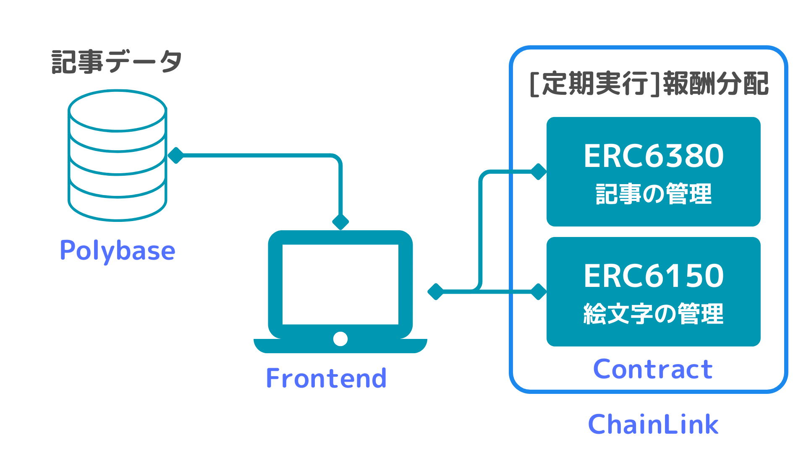

# 設計

## Contract

### ERC6150

- 記事の管理を行う。

### ERC6381

- 記事に付与する絵文字を管理する。

## Chainlink

- Chainlink Functionを使用して、報酬分配を自動化する。
- 毎月報酬分配を実行する。

## Frontend

- 記事の執筆を行う。

## Polybase

- 記事データの管理。
- いいねの管理。
