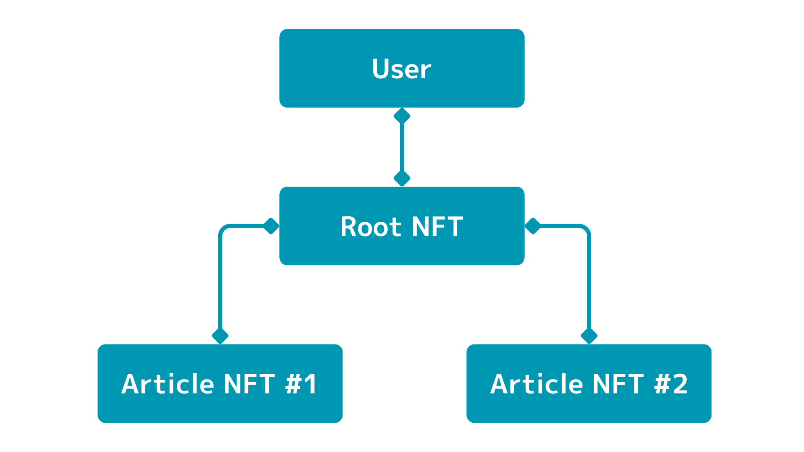
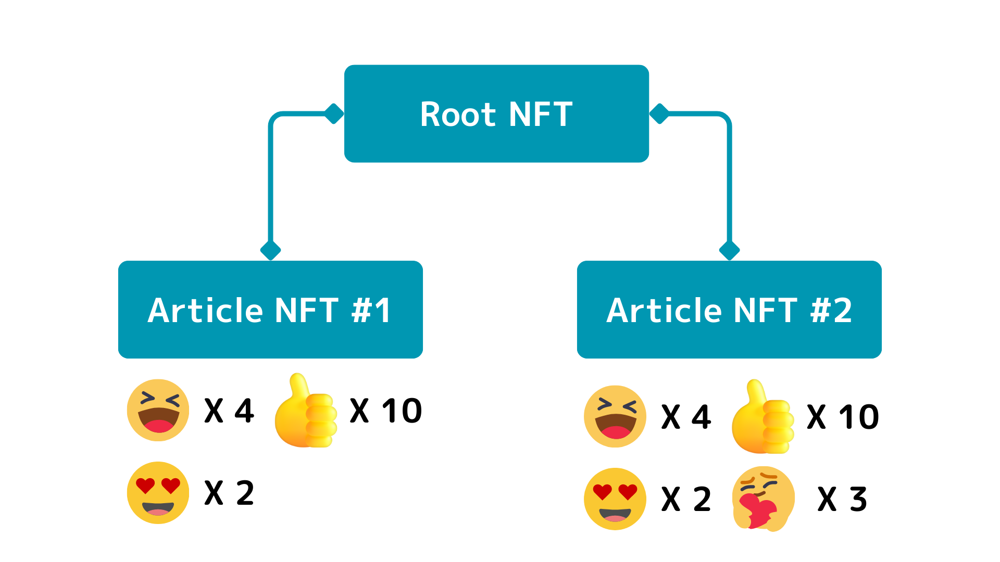
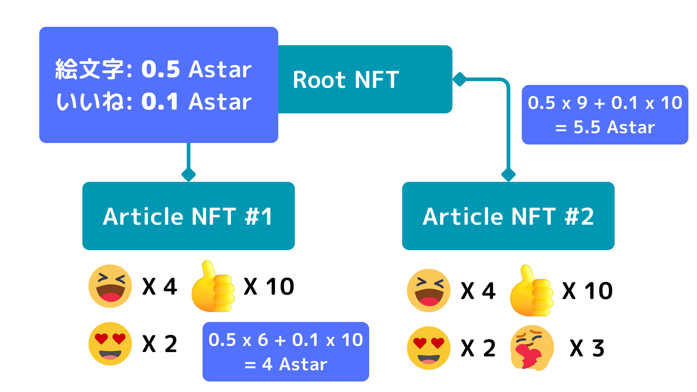
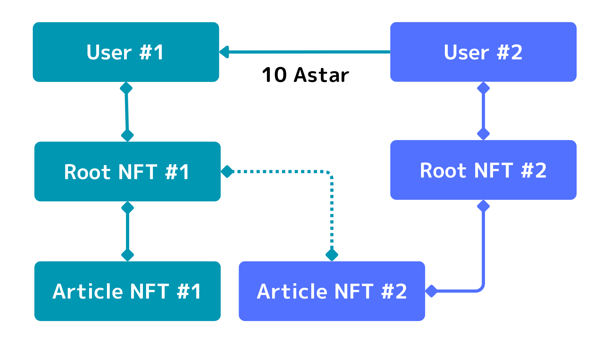
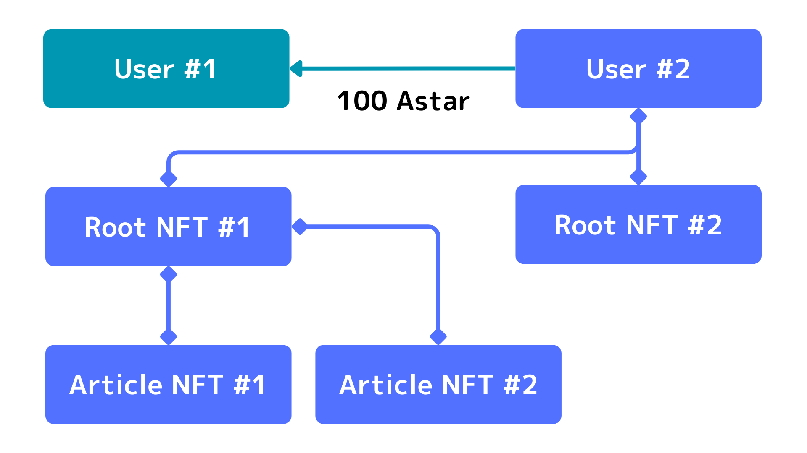

# 仕様

## 概要
- Output to Earnを実現する、記事投稿プラットフォームです。
- AstarのDapp Stakingを通じて報酬の分配を考えています。
- 記事を投稿して報酬を受け取るという世界を実現させたいです。

## 課題

### Web3関連の記事が少ない

現状Web3関連の記事、特に日本語の記事がまだまだ少ないです。
さらに、その中でも技術系の記事はまだまだ少ないです。
そもそも、Web3に興味を持って活動しているエンジニアが少ないのが現状です。
そのため、まずは記事の量を増やし目に触れる機会が多くなることで、Web3にしったり、興味を持ったり、印象が変わりWeb3に参入してくるエンジニアが増えるのではないかという仮説を立てています。

Web3関連の記事が少ない具体的な事例を紹介させてください。
以下のNotionには自分がまとめたERC関連の記事を一覧しています。

https://cardene.notion.site/ERC-EIP-2a03fa3ea33d43baa9ed82288f98d4a9?pvs=4

上記のERCの中で有名なERC（**ERC721**、**ERC20**、etc...）以外をネットで検索すると、自分の記事が日本語の記事ではトップに出てきます。
アルトコインでも代表格のEthereumへの採用された提案であるERCでも全然情報が少ないのが現状です。

また、日本でもトップの技術記事共有プラットフォームであるQiitaで、週間ユーザーランキング1位をとったり、月間ユーザーランキングで10位以内を取っていますが、Web3関連の記事にはいいねがつきづらい。

今回作成している「**KAKUSHIKA**」を通じて、記事を書く人の母数を増やしもっとWeb3の記事を増やしていくことが狙いです。
また、母数が増えることで記事が多様になるとも考えています。

### 記事を書いても金銭的リターンはない

いくら良い記事を書いても無料で公開しているうちは金銭的なリターンはありません。
もちろん自分も含め、エンジニアは金銭よりも「**誰かの役に立ちたい**」、「**自分の成長のため**」、「**認知度向上や名誉のため**」など金銭的リターンを期待していない人が多いです。
しかし、やはり良い記事を書いたのであればそれなりの金銭的リターンがある方が健全だと考えています。
そして、実は金銭的リターンは他にも記事執筆者にとってプラスに働きます。

ここでも1つ具体的な事例をご紹介しながら説明させてください。

**Zenn**というQiitaに次ぐ技術記事プラットフォームがあるのですが、この**Zenn**には投げ銭的な機能があります（バッジ機能）。
以前この投げ銭をいただいたことがありました。
この時の自分の心境としては、もちろん金銭的リターンが嬉しい気持ちもありつつ、「**誰かの役に立った**」ということに強く達成感のようなものを感じていました。

また、他事例として以下のように「**誰かの役に立った**」ということがわかることは、記事を書いている身からすると本当に嬉しいものです。

- https://twitter.com/DropMiin/status/1692178638928744487
- https://twitter.com/cardene777/status/1691721047136154067/retweets/with_comments

このように金銭的リターンは、単に「**お金が貰えてラッキー！！！**」よりも多くの影響を及ぼします。

## 背景

そもそもなぜこのように思うようになったかの背景をまとめます。

### アウトプットを推奨したい
自分はプログラミングを始めてすぐくらいから記事でアウトプットしてきました。
アウトプットすることで「**学んだことの定着**」、「**認知の拡大**」など多くのメリットがあることを実感しています。
そのため、まだあまりアウトプットしたことがない人にもぜひアウトプットしてもらいたいという気持ちがあります。
その気持ちから、以下のような記事を書いたりもしています。
  - [アウトプットはいいぞ！](https://qiita.com/cardene/items/9ef76cecc372351cc291)
  - [あれ？まだアウトプットしてないの？](https://qiita.com/cardene/items/ece21a4ad2bd7390b185)
  - [優しく『マサカリ』を投げ続けよう！](https://qiita.com/cardene/items/6f5f5c357b647b145fca)

また、2023年7月の1ヶ月で35記事を書いたりとある程度はアウトプットしてきました（2023年8月も達成できそうです）。  
そして自分が現在興味ある分野がWeb3です。  
Web3ではまだまだ記事が少なく、特に日本語の記事が少ないのでもっともっと記事を増やしていきたいという気持ちが強くなっていました。  
ただ、それには自分1人の力だけでは限界があります。  
そのため、アウトプットを推奨・したくなるようなプラットフォームを作成しようと思いつきました。  

### 良い記事を書いた人に還元

課題の点でも述べているように、いくら良い記事を書いても金銭面でのリターンはありません。  
Zennなどの技術記事プラットフォームでは投げ銭機能が存在するが、ほとんど使用されていない印象です。  
Qiitaなどの技術記事プラットフォームでは投げ銭機能が存在しないため、いくら良い記事を書いてもリターンはありません。  
もちろん記事を書いているエンジニアは金銭のためではなく、むしろ名誉や自信の技術力アップ、親切心などからアウトプットしていると思いますが、もっと金銭面での還元があっても良いと考えます。  

## 報酬の仕組み

- Dapp Stakingでのステーキング報酬をユーザーに分配する。
  - Dapp Stakingへの登録条件の詳細は調査中です。
  - https://docs.astar.network/docs/build/dapp-staking/for-devs/requirements
- 報酬分配の基準はいいね数 + 絵文字数。
- いいねはオフチェーンのDBで管理。
- 絵文字についてはERC6381を使用。
  - [[ERC6381] NFTに絵文字を付与することができる仕組みについて理解しよう！](https://qiita.com/cardene/items/d22d76d1cf66c34f1e57)
  - 絵文字をつけるには多少のガス代が必要なため、本当に良い記事にだけ絵文字をつけると想定。
- 記事自体はERC6150を使用することで、アドレスに対して記事を紐づけられるようにします。
  - [[ERC6150] NFTにLinuxのファイルシステムのような階層構造を持たせる仕組みを理解しよう！](https://qiita.com/cardene/items/38c75ae824373684aecd)
  - 記事自体をNFTにでき、ユーザー記事を管理するルートとなる部分もNFTなため、記事の権利を売買できる。
  - これにより、記事を売買することで報酬を受け取れるユーザーを変更できる。
  - 有望な記事の継続報酬を放棄する代わりに、NFT販売利益を渡すことができる。
 
## Why Blockchain

今回ERC6381やERC6150をなぜ使用しているかについて、それぞれの規格ごとに説明していきます。

### ERC6381

この規格はNFTに絵文字を付与でき、付与した絵文字をブロックチェーンで管理することができる規格になっています。
「**オフチェーンでよくね**」
上記のように思われる方もいると思いますが、それではダメなんです。
普通のいいねの場合、記事を読んだユーザーは特に何も考えずいいねを押すことができます。
もちろん、個々人でいいねをする基準はあると思いますが、押すことで何かしらデメリットが生じることはありません。
一方、ブロックチェーン上で管理している絵文字の場合は、絵文字をつけるためにガス代がかかってきます。
このガス代がかかるという若干の負荷があることで、「**本当に良い記事に絵文字をつけよう**」という行動につながります。
この理由から、オンチェーンで管理できるようにしています。

### ERC6150

この規格は、NFTをファイル構造のように階層を持たせることができる規格です。
記事自体、というよりは記事に紐づけられた報酬を受け取れるNFTをブロックチェーンで管理しています。
記事自体はオフチェーンのDBで管理していても、報酬をつ受け取れる権利はNFTの所有者にあります。
これにより、報酬を受け取れる権利を売買することができます。
記事執筆者は長期的な報酬分配の権利を放棄することで、一時的に多くの資金を受け取れることができるようになります。
記事執筆者としての名前はもちろん記事内に残りますが、記事の報酬分配権を売買できるため、この規格も必要であると考えています。

## 図解

- ERC6150の仕組み。

- 記事にいいね・絵文字をつける。

- 報酬計算

- 記事の売買

- Root NFTの売買

## 考慮事項

### ガス代
- ERC6150を使用すると各記事がNFTになるため、記事投稿時にガス代がかかります。
- おそらくAstarのFaucetから少量ながらガス代を受け取ることができると思うので、最初の数記事はガス代内で負担してもらう。
- その後報酬をもらえるため、報酬の一部を使用して記事を書いていただく。

### 自分自身で絵文字をつける

- 絵文字をつけるガス代よりも報酬の方が多ければ、自分で絵文字をつけてしまう可能性があります。
- この部分の対策については考え中です。

### ガス代の負荷

昨今徐々にガス代が安くなってきています。
そのため、絵文字を付与するハードルがだいぶ低くなります。
これにより、いいねを押す感覚で絵文字を付与できてしまうので、何かしら対策を考えるべきか、それも含めユーザーの行動に委ねられるため健全な状態と判断するか悩んでいます。
